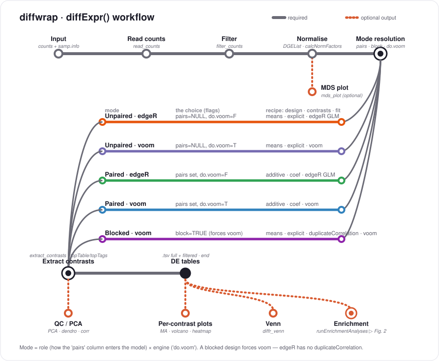
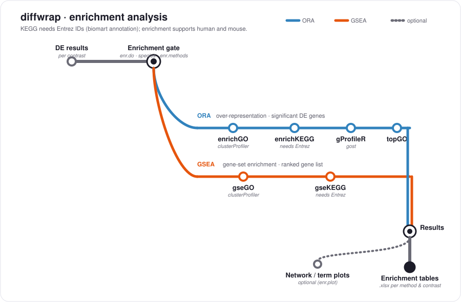

# diffwrap

<!-- badges: start -->
[](https://CRAN.R-project.org/package=diffwrap)
[](https://www.gnu.org/licenses/gpl-3.0)
<!-- badges: end -->

**Differential expression analysis of RNA-Seq data.**

`diffwrap` wraps the **edgeR**–**limma** differential-expression workflow into a single
convenience function, `diffExpr()`, that takes raw read counts (or CAP-miRSeq miRNA
expression values) and produces annotated result tables, publication-style plots,
quality-control diagnostics and, optionally, functional enrichment — all with sensible
defaults. Every step is also exported as its own function, so the pipeline can be run
end-to-end or step by step.

## Features

- One call from count files/matrix to full results: `diffExpr()`.
- Five well-defined **analysis modes** resolved from just three arguments
  (`pairs`, `block`, `do.voom`) — unpaired, paired, or blocked designs, run through
  either the edgeR GLM or the limma/voom engine.
- Optional gene annotation via **biomart**, with an offline Ensembl→symbol fallback.
- Per-contrast MA plots, volcano plots (p-value and FDR), heatmaps, and cross-contrast
  Venn diagrams.
- Optional over-representation (ORA) and gene-set (GSEA) enrichment through
  **clusterProfiler**, **gProfileR** and **topGO**.
- A single run log and fully suppressible console output.
- Reproducible example data shipped with the package.

## Installation

```r
# from source
install.packages("diffwrap_0.5-13.tar.gz", repos = NULL, type = "source")

# or the development version from GitHub (replace OWNER with the repository owner)
# install.packages("remotes")
remotes::install_github("OWNER/diffwrap")
```

The core engines (**edgeR**, **limma**) are installed as dependencies. Optional features
pull in their packages only when used: biomart annotation, enrichment
(**clusterProfiler**, **gprofiler2**, **topGO**), and the organism annotation packages
(`org.Hs.eg.db` for human, `org.Mm.eg.db` for mouse) live in `Suggests`.

## Quick start

The package ships a small **simulated** data set (eight samples, two groups of four,
one control + one treated sample per subject) so the whole workflow runs with no external
data or network access:

```r
library(diffwrap)

res <- diffExpr(
  expr.dat      = diffwrap_counts,      # count matrix (or file path[s])
  samp.info     = diffwrap_samp_info,   # sample sheet
  samples       = "SampleName",
  groups        = "Group",
  control       = "control",
  analysis.name = "demo",
  out.dir       = tempdir(),            # required: where results are written
  enr.do        = FALSE                 # skip enrichment for a quick run
)
```

`diffExpr()` returns a list of the intermediate objects (the `DGEList`/`voom` object, the
model fits, and one annotated result table per contrast) but is primarily called for its
side effects: below `out.dir` you get, per contrast, full and filtered DE tables, a PDF of
the MA/volcano/p-value plots, heatmaps, a Venn diagram across contrasts, and a run log.

## Pipeline overview

Pre-processing runs across the top (with MDS as an optional side branch), then a
*Mode resolution* hub fans into **five colour-coded mode lanes** — each showing the flags
that select it (`pairs`/`block`/`do.voom`) and the resulting recipe (design · contrasts ·
fit). The lanes reconverge at contrast extraction; the required pipeline ends at the DE
tables, and QC, per-contrast plots, Venn and enrichment hang off as optional (dashed)
outputs.



## Analysis modes

Three arguments — `pairs`, `block` and `do.voom` — resolve into one of five modes. The
first axis is **how the `pairs` column enters the model**; the second is **which engine
performs the test**. A blocked design forces the limma/voom engine, because edgeR has no
equivalent of `duplicateCorrelation()`; if `block = TRUE` is combined with
`do.voom = FALSE`, voom is enabled automatically and the reason is logged.

| `pairs` | `block` | `do.voom` | Design | Engine | Role of `pairs` |
|---------|---------|-----------|--------|--------|-----------------|
| — | `FALSE` | `FALSE` | `~0 + groups` | edgeR GLM | — |
| — | `FALSE` | `TRUE` | `~0 + groups` | limma/voom | — |
| given | `FALSE` | `FALSE` | `~pairs + groups` | edgeR GLM | fixed effect |
| given | `FALSE` | `TRUE` | `~pairs + groups` | limma/voom | fixed effect |
| given | `TRUE` | forced `TRUE` | `~0 + groups` | limma/voom | correlation block |

```r
# paired (Subject as a fixed effect)
res <- diffExpr(diffwrap_counts, diffwrap_samp_info, samples = "SampleName",
                groups = "Group", control = "control", pairs = "Subject",
                analysis.name = "paired", out.dir = tempdir(), enr.do = FALSE)

# blocked (Subject as a correlation block; forces voom)
res <- diffExpr(diffwrap_counts, diffwrap_samp_info, samples = "SampleName",
                groups = "Group", control = "control", pairs = "Subject",
                block = TRUE, analysis.name = "blocked", out.dir = tempdir(),
                enr.do = FALSE)
```

## Enrichment (optional)

When `enr.do = TRUE`, the DE results feed a separate enrichment stage — over-representation
(ORA) on significant genes and gene-set enrichment (GSEA) on the ranked list — across the
methods chosen in `enr.methods`. KEGG requires Entrez IDs and therefore needs biomart
annotation (`biom.use = TRUE`); enrichment supports human and mouse.



## Outputs

Below `out.dir`, per contrast: full and filtered differential-expression tables, a PDF with
MA, volcano and p-value plots, heatmaps of the top features, a Venn diagram plus
intersection tables across contrasts, and — if requested — enrichment tables (`.xlsx`) and
plots. A single run log records every step; console verbosity is controlled by `verbose`
and can be silenced entirely.

## Documentation

See the package vignette for a full walk-through, including running the steps manually and
interpreting the outputs:

```r
vignette("diffwrap-vignette", package = "diffwrap")
```

## Methods and citation

The workflow builds on the following methods:

- Robinson MD, McCarthy DJ, Smyth GK (2010). *edgeR.* Bioinformatics 26(1):139–140.
  <doi:10.1093/bioinformatics/btp616>
- Ritchie ME, *et al.* (2015). *limma.* Nucleic Acids Research 43(7):e47.
  <doi:10.1093/nar/gkv007>
- Law CW, Chen Y, Shi W, Smyth GK (2014). *voom.* Genome Biology 15:R29.
  <doi:10.1186/gb-2014-15-2-r29>
- Sun J, *et al.* (2014). *CAP-miRSeq.* BMC Genomics 15:423.
  <doi:10.1186/1471-2164-15-423>

## Authors

Vidal Fey (maintainer), Meeri Pekkarinen, Reija Hieta, Bogdan Iancu, Adrien Janssens.

## License

GPL-3.
